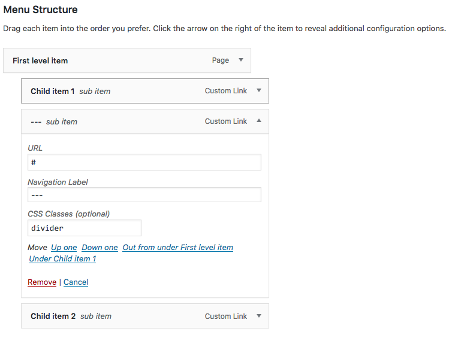
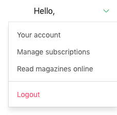

# BulmaWalker
A simple class to create WordPress menus based on the [Bulma](https://bulma.io/) CSS Framework [Navbar component](https://bulma.io/documentation/components/navbar/)

## Usage
Define a new Walker instance in your `wp_nav_menu` calls, like this:

```php
wp_nav_menu([
    'theme_location' => 'primary_navigation',
    'walker' => new \App\BulmaWalker()
]);
```

## Capabilities

### Dropdowns
The walker will check if the current item in the menu has the class `menu-item-has-children`. If so, it will output the necessary markup to generate a Bulma [Dropdown element](https://bulma.io/documentation/components/navbar/#dropdown-menu)

```html
<div class="navbar-item has-dropdown">
    
    <a class="navbar-link">
      First level item
    </a>

    <div class="navbar-dropdown">
      <a class="navbar-item">Child item 1</a>
      <a class="navbar-item">Child item 2</a>
      <a class="navbar-item">...</a>
    </div>
  </div>
```

### Dividers
You can add a custom link item to your WordPress menu, give it a class of `divider` and the walker will replace it with a `navbar-divider` element

In WordPress, under Appearance > Menus


Resulting HTML
```html
<div class="navbar-item has-dropdown">
    
    <a class="navbar-link">
      First level item
    </a>

    <div class="navbar-dropdown">
      <a class="navbar-item">Child item 1</a>
      <hr class="navbar-divider">    
      <a class="navbar-item">Child item 2</a>
    </div>
  </div>
```

### Bulma helper classes
Items can have helper classes as explained [here](https://bulma.io/documentation/modifiers/typography-helpers/). I haven't tested other helper classes, they might break the layout of your menu.

An example of a `navbar-item` with the class `has-text-danger`



### ToDo

- clean up some messy code
- figure out a way to add icons to menu items